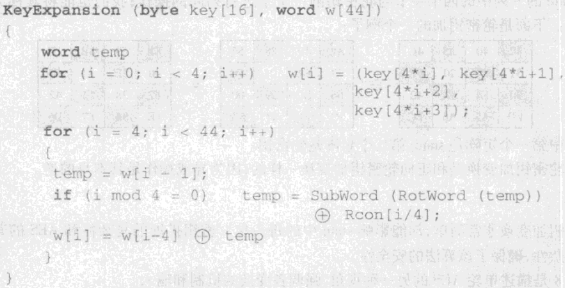
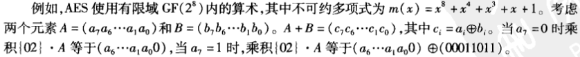

1. 3DES
2. AES
    1. concept
        1. interated block cipher
        2. not a feistel cipher
            1. operates on entire block per round
            2. decryption is not identical to encryption
        3. designed to
            1. be resistant against known attacks
            2. etc
    2. overview
        1. block size:128
        2. key length
            1. 128/192/256
        3. 10/12/14 rounds: depends on key length, 128 bits subkey used each round
        4. AES versions
    3. 
        1. 轮密钥加是一种Vernam密码形式，其他三个阶段起到混淆、扩散、非线性功能，故AES可视为XOR与混淆的交替执行。
    4. AES的变换函数
        1. 字节代替变换
            1. 查表
                S盒，一个16^16字节的矩阵，包含了256个数的一个置换。 
                正向变换 
                state的每个字节按照如下方式映射为一个新的字节：高四位作为行值，低四位作为列值，构成一个索引从S盒取出元素作为新的字节。 
            2. S盒生成方式
        2. 行移位变换
            正向变换 
            state的第n行的元素循环左移n-1位 
            某列的4字节被扩展到了4个不同的列，于是实现了扩散 
        3. 列混淆变换
            正向 
            对每列独立进行；每个字节被映射为一个新值。映射可用矩阵乘法描述。 
            矩阵a: 
            02 03 01 01 
            01 02 03 01 
            01 01 02 03 
            03 01 01 02 
            state = a * state 
            这里的乘法和加法定义在域GF(2^8)上。
        4. 密钥加
            state与轮密钥按位异或；可以视为字节异或，或是列之间异或
    5. 密钥扩展
        伪代码描述
            
        1. 轮常量Rcon
            一个字，后三个字节为0。 
            每轮的轮常量均不同，定义为Rcon[j] = (RC[j],0,0,0),RC[1]=1,RC[j]=2*RC[j-1] 
            这里的乘法是定义在域GF(2^8)上的。 
            RC[j]的值如下(hexical) 
            
            |j|1|2|3|4|5|6|7|8|9|10|
            |---|---|---|---|---|---|---|---|---|---|---|
            |RC[j]|01|02|04|08|10|20|40|80|1B|36|
        2. 下标i为4的倍数时，对其前一个元素的处理函数g
            注：实际上这里处理的是该元素的拷贝temp
            1. 字循环rotation word
                循环左移1字节
            2. 字代替
                用S盒进行字节代替
            3. 与Rcon[I/4]异或
        3. w[i] = w[i - 4] xor temp;
        4. 基本原理
            
    6. GF(2^8)
        
        加法定义为位异或，乘法定义为有限域GF(2^8)内的乘法