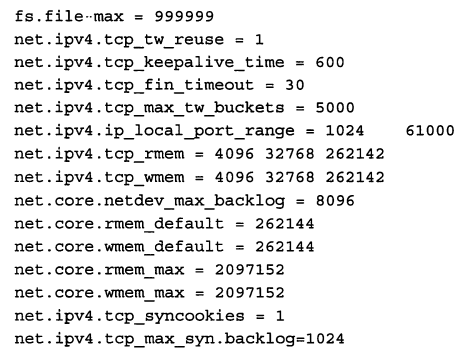
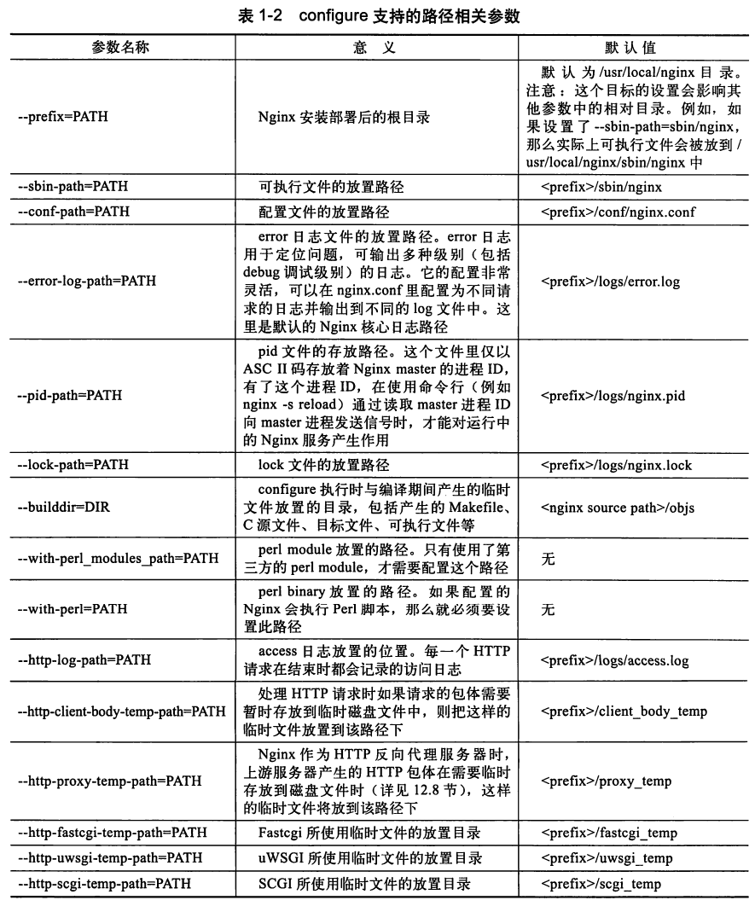
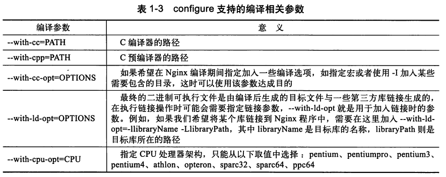
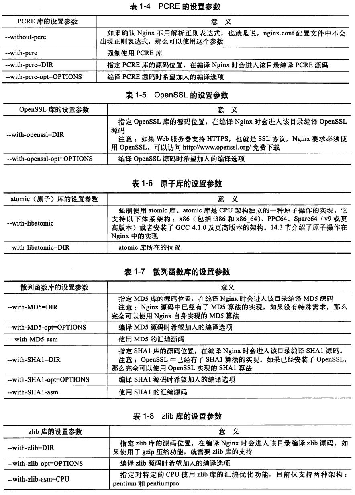
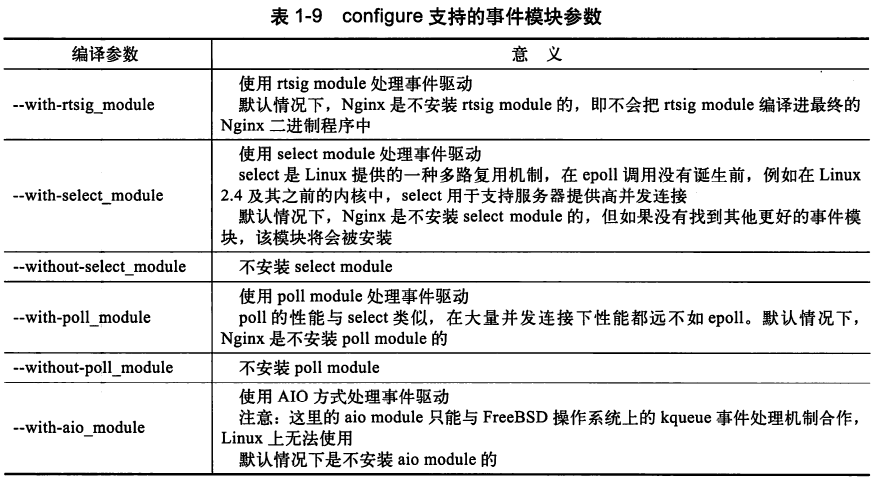
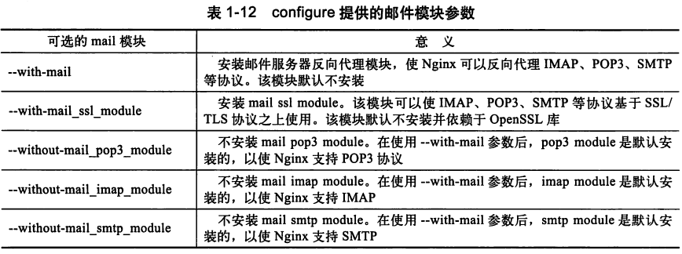
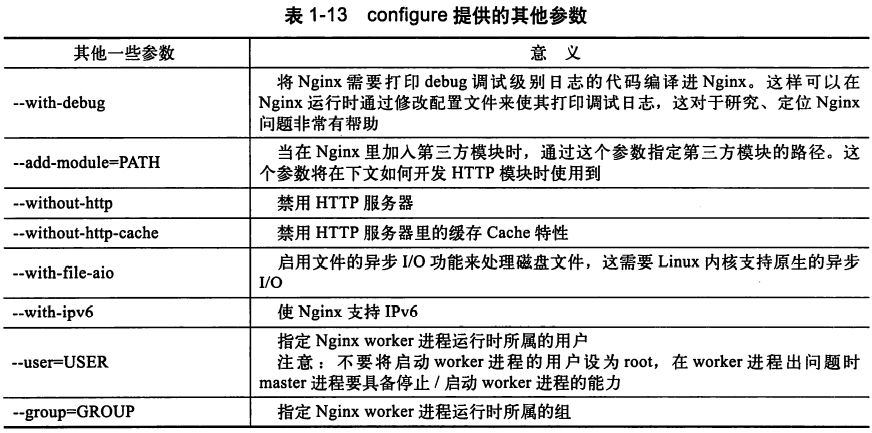

1. 依赖
    1. gcc gcc-c++
    2. pcre pcre-devel
    3. zlib zlib-devel
    4. openssl openssl-devel
2. 目录
    1. 源码存放目录
    2. objs目录
        编译阶段中间文件目录
        默认为源码目录下的objs目录
    3. 部署目录
        服务运行时需要的二进制文件与配置文件等，默认为/usr/local/nginx
    4. 日志目录
        日志文件一般比较大，可能需要专门的硬盘
3. 内核参数优化
    1. 最通用：支持更多并发请求的TCP网络参数
        1. /etc/sysctl.conf
            
            修改配置后需要使用sysctl -p命令使其生效
            1. 最常用的配置
                
            2. 参数说明
                1. file-max: 一个进程可以同时打开的最大句柄数， 直接限制了最大并发连接数， 可以根据实际情况进行配置
                2. tcp_tw_reuse: 设为1时， 允许将TIME-WAIT状态的socket重新用于新的TCP连接； 服务器上总有大量TIME-WAIT状态连接，因此很有意义
                3. tcp_keepalive_time: keepalive启用时， TCP发送keepalive消息的频度， 默认为2h。 设置得更小些，可以更快地清理无效的连接。
                4. tcp_fin_timeout: 服务器主动关闭连接时， socket保持在FIN-WAIT-2状态的最大时间
                5. tcp_max_tw_buckets: 操作系统允许TIME-WAIT套接字数量的最大值， 超过这个数字， TIME-WAIT套接字将立即被清除并打印警告信息。 默认为18000， 过多的TIME-WAIT会使web服务器变慢。
                6. tcp_max_syn_backlog: TCP三次握手阶段建立接收SYN请求队列的最大长度， 默认为1024。 设置得更大一些， 可以使nginx来不及accept时， linux不至于丢失客户端发起的连接请求
                7. ip_local_port_range: 定义了UCP和TCP连接中本地端口的取值范围
                8. net.ipv4.tcp_rmem: TCP接收缓存(TCP接收滑动窗口)的最大值、最小值、默认值
                9. net.ipv4.tcp_wmem: TCP发送缓存(TCP发送滑动窗口)的最大值、最小值、默认值
                10. netdev_max_backlog: 网卡接收数据包速度大于内核处理速度时， 保存这些数据包的队列的最大值
                11. rmem_default: 内核套接字接收缓存区默认大小
                12. wmem_default: 内核套接字发送缓存区默认大小
                13. rmem_max: 内核套接字接收缓存区最大大小
                14. wmwm_max: 内核套接字发送缓存区最大大小
                15. tcp_syncookies: 用于解决TCP的SYN攻击， 与性能无关
            3. 关于参数的更多问题
                滑动窗口的大小和套接字缓存区会影响并发连接的数量； 每个TCP连接都会为维护滑动窗口而消耗内存， 该窗口根据服务器处理速度收缩或扩张
                wmem_max的设置需要平衡物理内存的总大小、 Nginx并发处理的最大连接数(由nginx.conf中的worker_processes和worker_connections参数决定)。 如果滑动窗口过小， 会影响大数据量的传输速度。如果滑动窗口过大， 可能会导致Out Of Memory问题。
                rmem_default、wmem_default、rmem_max、wmem_max需要根据业务特性和硬件成本综合考虑
4. configure详解
    1. 命令参数
        1. 路径相关
             
            
        2. 编译相关
            
            
        3. 依赖软件的相关参数

            
        4. 模块相关

            1. 事件模块
                
                
            2. 默认编译进nginx的http模块

                默认编译的核心http模块参数，以及如何去除
                
            3. 默认不会编译进nginx的http模块

                
            4. mail模块

                
            5. 其他模块

                
    2. configure执行流程与命令解释
        1. 执行流程

            page19-page21
        2. notes

            1. 源码目录/auto/modules: 该脚本生成ngx_modules.c文件， 该文件会被编译到nginx中。 它定义了ngx_modules数组， 该数组指明了nginx运行期间有哪些模块会参与到请求的处理中。 因此， nginx对该数组元素的顺序十分敏感， 绝大部分模块在该数组中的顺序是固定的。 我们在--add-module=参数中加入的第三方模块也在此步骤中写入到ngx_modules.c中了
            2. configure脚本检查某特性是否存在时， 生成一个只包含main函数的C程序， 该程序包含相应头文件， 若编译通过， 视为特性存在， 结果记录在autoconf.err中。 后续检查头文件、特性的脚本用的方法类似。
    3. configure生成的文件
        1. configure执行成功时
            1. objs目录

                1. 关键文件

                    1. ngx_modules.c

                        默认配置下的内容如下； 该文件的作用就是定义了ngx_modules数组。 
                        ngx_modules数组指明了每个模块的优先级， 当一个请求同时符合多个模块的处理规则时， 将按照他们在ngx_modules数组中的顺序确定优先顺序。 
                         对于http过滤模块， 则是更靠后的模块先进行处理。 这是因为在http框架初始化时， ngx_modules数组中的过滤模块会被用头插法加入过滤链表， 这样顺序就倒了过来。

                            #include <ngx_config.h>
                            #include <ngx_core.h>

                            // 这里有ngx_modules数组的各元素的extern声明。现在省略掉。

                            ngx_module_t *ngx_modules[] = {
                                &ngx_core_module,
                                &ngx_errlog_module,
                                &ngx_conf_module,
                                &ngx_regex_module,
                                &ngx_events_module,
                                &ngx_event_core_module,
                                &ngx_epoll_module,
                                &ngx_http_module,
                                &ngx_http_core_module,
                                &ngx_http_log_module,
                                &ngx_http_upstream_module,
                                &ngx_http_static_module,
                                &ngx_http_autoindex_module,
                                &ngx_http_index_module,
                                &ngx_http_mirror_module,
                                &ngx_http_try_files_module,
                                &ngx_http_auth_basic_module,
                                &ngx_http_access_module,
                                &ngx_http_limit_conn_module,
                                &ngx_http_limit_req_module,
                                &ngx_http_geo_module,
                                &ngx_http_map_module,
                                &ngx_http_split_clients_module,
                                &ngx_http_referer_module,
                                &ngx_http_rewrite_module,
                                &ngx_http_proxy_module,
                                &ngx_http_fastcgi_module,
                                &ngx_http_uwsgi_module,
                                &ngx_http_scgi_module,
                                &ngx_http_memcached_module,
                                &ngx_http_empty_gif_module,
                                &ngx_http_browser_module,
                                &ngx_http_upstream_hash_module,
                                &ngx_http_upstream_ip_hash_module,
                                &ngx_http_upstream_least_conn_module,
                                &ngx_http_upstream_random_module,
                                &ngx_http_upstream_keepalive_module,
                                &ngx_http_upstream_zone_module,
                                &ngx_http_write_filter_module,
                                &ngx_http_header_filter_module,
                                &ngx_http_chunked_filter_module,
                                &ngx_http_range_header_filter_module,
                                &ngx_http_gzip_filter_module,
                                &ngx_http_postpone_filter_module,
                                &ngx_http_ssi_filter_module,
                                &ngx_http_charset_filter_module,
                                &ngx_http_userid_filter_module,
                                &ngx_http_headers_filter_module,
                                &ngx_http_copy_filter_module,
                                &ngx_http_range_body_filter_module,
                                &ngx_http_not_modified_filter_module,
                                NULL
                            };

                            // 这里是char *ngx_module_names[]， 其元素为以上各模块的名字字符串，以及最后的一个NULL，这里省略
5. 命令行控制
    1. 默认启动
        直接执行二进制程序，如/usr/local/nginx/sbin/nginx
         这种情况是根据configure执行时的--conf-path=参数指定的nginx.conf文件启动， 如果以默认方式执行configure， 那么默认启动根据 /usr/local/nginx/conf/nginx.conf进行
    2. 使用-c另行指定配置文件
        如/usr/local/nginx/sbin/nginx -c configpath/nginx.conf
    3. 使用-p另行指定安装目录
        没明白
    4. 使用-g另行指定全局配置项
        如/usr/local/nginx/sbin/nginx -g "pid /var/nginx/test.pid;"
         上面这条命令意味着将pid文件写到/var/nginx/test.pid中。
         -g的一条约束条件是， 指定的配置项不能与默认路径下的nginx.conf中的配置项相冲突， 否则无法启动。 比如，如果使用上面的命令， pid logs/nginx.pid就不能存在于nginx.conf中
         另一个约束条件是， 以-g启动的nginx执行其他命令时， 需要加上启动时的-g参数， 否则可能配置项不匹配。 比如， 要停止上面的命令启动的nginx服务， 需要使用/usr/local/nginx/sbin/nginx -g "pid /var/nginx/test.pid;" -s stop命令。
    5. 使用-t测试配置文件是否有错误。不会启动nginx。
        1. 如果再加上-q， 则不会输出error级别以下的信息到屏幕
    6. 使用-v显示版本信息
    7. 使用-V显示编译阶段的参数
    8. 使用-s stop快速停止服务
        原理是nginx根据nginx.pid文件中记录的pid向master进程发送term信号。 效果与直接向master进程发送term或int信号相同。
    9. 使用-s quit， 使nginx处理完当前所有请求后再停止服务
        原理是向master进程发送QUIT信号，然后master进程向worker进程发送WINCH信号 
        TERM或INT信号会使worker进程与master进程立刻跳出循环并结束进程， 使用-s quit时则是先关闭监听端口， 然后处理当前的连接， 最后退出进程。 
        使用WINCH是因为后台进程用不到这个信号量。因此可以用来做这个事。
    10. 使用-s reload重新加载配置项
        HUP信号。 
        先检查新的配置项是否有误， 如果全部正确， 就“-s quit”， 然后重启nginx。
    11. 使用-s reopen进行日志文件回滚
        向master进程发送USR1信号 
        可以先将当前日志文件改名或转移到其他目录下， 重新打开时就会生成新的日志文件。 这样使得日志文件不至于过大。 
    12. 平滑升级Nginx
        1. USR2信号通知正在运行的master进程准备升级。 此时nginx会将pid文件重命名， 否则新的nginx不能成功启动。
        2. 启动新版本的nginx
        3. 向旧版本master进程发送QUIT信号
    13. -h或-?显示命令行帮助