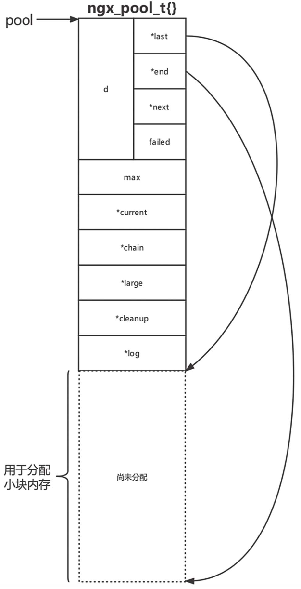
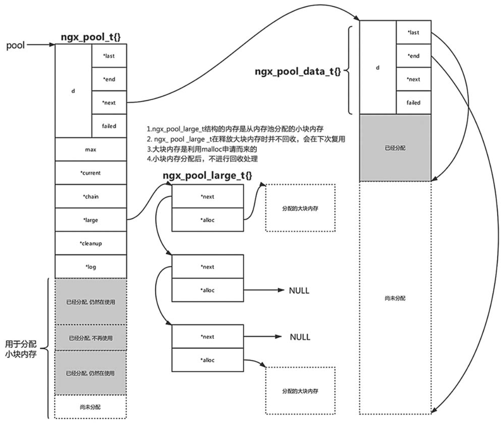
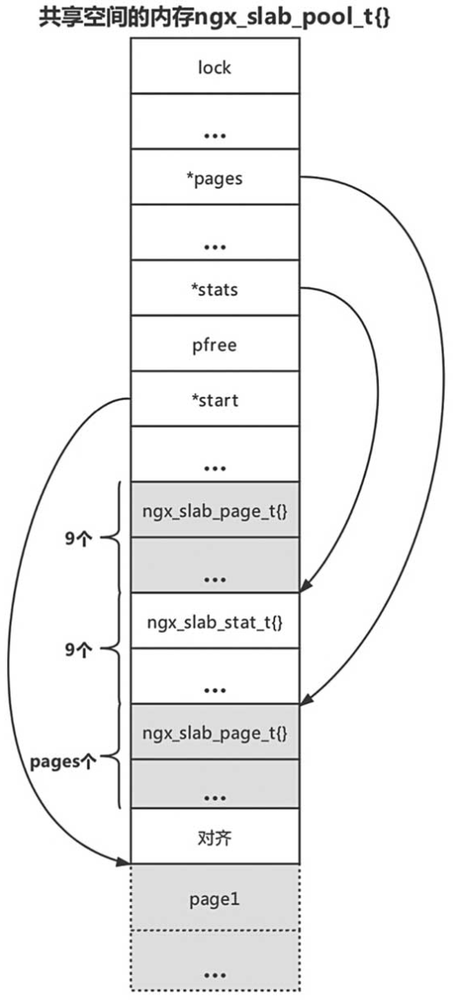
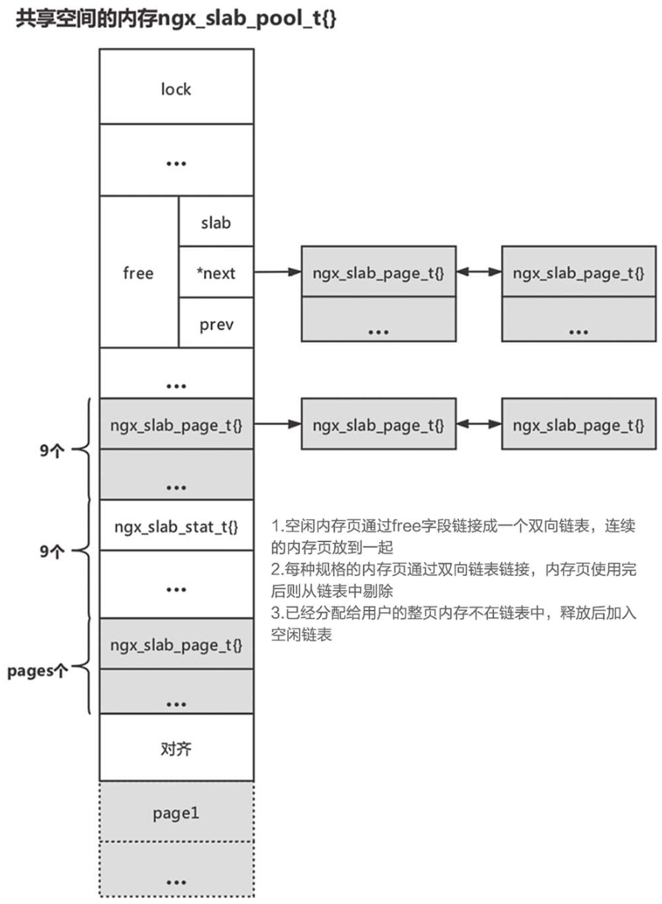

1. 内存管理概述
    内存管理是指程序运行时对计算机内存资源分配和使用的技术。内存管理的主要目的是快速、高效地分配内存，并且在合适的时间释放和回收内存资源。高效的内存管理能够极大地提高程序性能。
2. nginx内存管理简介
    1. 释放内存对于单线程比较简单，但是对于多线程会烦琐得多，因为需要知道在哪个时刻才能释放内存。很多高级语言提供了垃圾回收机制，如Java、Go，但是对于没有垃圾回收机制的C语言、C++语言而言，内存回收则会复杂得多。
    2. 工作进程之间需要通信，Nginx采用共享内存方案，比如记录总的请求数。通过共享内存，每个工作线程在处理请求时都会更新位于共享内存中用于记录总请求数的变量。对于Nginx而言，不仅每个进程自身需要内存管理，进程之间共享的内存也需要内存管理。
    3. 站在内存管理员的角度看，当应用程序申请内存时，我们需要快速找到符合要求的内存块。当应用程序释放内存时，我们需要快速回收内存，减少内存碎片。
    4. nginx内存管理代码参考src/core/ngx_palloc.h、src/core/ngx_palloc.c
3. nginx内存池
    nginx将内存分为小块内存和大块内存。小块内存将在内存池释放时进行释放，用户无需释放。对于大块内存，用户可以调用接口释放或者等待内存池释放时一起释放。 内存池支持增加回调函数，在内存释放时自动调用，以便释放用户申请的其他资源。回调函数可以用链表进行链接。
    1. 结构
        1. 主要结构体
            1. ngx_pool_large_s

                    typedef struct ngx_pool_large_s  ngx_pool_large_t;
                    struct ngx_pool_large_s {
                        ngx_pool_large_t     *next; // 用于构成链表
                        void                 *alloc; // 指向真正的大块内存
                    };

            2. ngx_pool_data_t

                    typedef struct {
                        u_char               *last; // 指向小块内存已分配末地址的下一个地址；可分配首地址
                        u_char               *end;  // 指向小块内存可分配地址的末地址的下一个地址
                        ngx_pool_t           *next;
                        ngx_uint_t            failed;
                    } ngx_pool_data_t;

            3. ngx_pool_s

                    typedef struct ngx_pool_s  ngx_pool_t;
                    struct ngx_pool_s {
                        ngx_pool_data_t       d;
                        size_t                max;
                        ngx_pool_t           *current;
                        ngx_chain_t          *chain;
                        ngx_pool_large_t     *large;
                        ngx_pool_cleanup_t   *cleanup;
                        ngx_log_t            *log;
                    };

        2. 内存池初始结构

            ngx_pool_t + 小块内存 
            
            
    2. 内存池创建
        1. ngx_create_pool函数

                // 返回创建的内存池地址，size为内存池每个内存块大小，log为打印日志
                ngx_pool_t * ngx_create_pool(size_t size, ngx_log_t *log){
                    ngx_pool_t  *p;

                    // 申请内存，如果系统支持内存地址对齐，则默认申请16字节对齐地址
                    p = ngx_memalign(NGX_POOL_ALIGNMENT, size, log);
                    if (p == NULL) return NULL;

                    // 初始化内存池
                    p->d.last = (u_char *) p + sizeof(ngx_pool_t); // 这是指向了ngx_pool_t结构体之后
                    p->d.end = (u_char *) p + size; // size是内存块的大小，这就是指向了第二个块的首地址
                    p->d.next = NULL;
                    p->d.failed = 0;

                    // 计算内存池中每个内存块最大可以分配的内存
                    size = size - sizeof(ngx_pool_t);
                    p->max = (size < NGX_MAX_ALLOC_FROM_POOL) ? size : NGX_MAX_ALLOC_FROM_POOL;

                    p->current = p;
                    p->chain = NULL;
                    p->large = NULL;
                    p->cleanup = NULL;
                    p->log = log;
                    return p;
                }

    3. 从内存池申请内存

        ngx_palloc：获取内存但不初始化；首地址内存对齐，为4或8的倍数 
        ngx_pcalloc：封装palloc，获取内存并初始化 
        ngx_pnalloc：获取内存但不考虑对齐 
        1. ngx_palloc

            void * ngx_palloc(ngx_pool_t *pool, size_t size){
                if (size <= pool->max) 
                    return ngx_palloc_small(pool, size, 1);
                return ngx_palloc_large(pool, size);
            }

            1. ngx_palloc_small

                首先根据d.last和内存对齐确认本次分配的起始地址，然后计算剩余内存是否够用，不够则在下一块中查找，找不到就重新申请一个内存块并用其分配。
                 
                每次新申请内存，就增加原有内存块的失败次数，当某内存块失败超过4次时，不再尝试从该内存块分配内存。
                 
                ##### 问题：这里不断增加会最终导致溢出吗？还是说加到5就不加了？
                 
                函数声明： static void * ngx_palloc_small(ngx_pool_t *pool, size_t size, ngx_uint_t align); 
                核心逻辑代码： 

                    static void *
                    ngx_palloc_small(ngx_pool_t *pool, size_t size, ngx_uint_t align){
                        u_char      *m;
                        ngx_pool_t  *p;
                        p = pool->current;
                        do {
                            m = p->d.last;
                            // 内存对齐
                            if (align) m = ngx_align_ptr(m, NGX_ALIGNMENT);
                            if ((size_t) (p->d.end - m) >= size) {
                                p->d.last = m + size;
                                return m;
                            }
                            p = p->d.next;
                        } while (p);
                            // 重新申请一块内存用于小块内存申请
                            return ngx_palloc_block(pool, size);
                    }
            
            2. ngx_palloc_large

                大块内存在需要时申请相应大小的内存块，再通过large链表将其链接。 大块内存的链表节点所用空间从内存池中申请，便于释放。
                 
                函数声明： 
                    static void * ngx_palloc_large(ngx_pool_t *pool, size_t size);
                 
                核心代码：
                 

                    static void * ngx_palloc_large(ngx_pool_t *pool, size_t size){
                        void              *p;
                        ngx_uint_t         n;
                        ngx_pool_large_t  *large;
                        // 申请内存
                        p = ngx_alloc(size, pool->log);
                        if (p == NULL) return NULL;
                        // 获取大块内存管理的链表结构，该结构可以复用
                        n = 0;
                        for (large = pool->large; large; large = large->next) {
                            if (large->alloc == NULL) { 
                                // 这是因为nginx提供了释放大块内存的接口，之前分配的大块内存有可能已经释放了，现在就把新申请的内存加入到这个链表中
                                large->alloc = p;
                                return p;
                            }
                            if (n++ > 3) break;
                            // 这里的意思是，后面可能可用的大块内存的节点就不管了？有点好奇什么时候内存池会被释放了。
                            // emm就先这样吧，说不定编者认为不是核心逻辑？
                        }
                        // 直接从内存池中申请大块内存管理的链表节点
                        large = ngx_palloc_small(pool, sizeof(ngx_pool_large_t), 1);
                        if (large == NULL) {
                            ngx_free(p);
                            return NULL;
                        }
                        large->alloc = p;
                        // 将大块内存放到内存池中，也就是放到链表头部，便于维护管理
                        large->next = pool->large;
                        pool->large = large;
                        return p;
                    }
        2. nginx内存池基本结构

            
    4. 释放内存
        1. 大块内存释放
            1. ngx_pfree

                    ngx_int_t ngx_pfree(ngx_pool_t *pool, void *p){
                        ngx_pool_large_t  *l;
                        // 遍历大块内存链表
                        for (l = pool->large; l; l = l->next) {
                            // 如果找到这块内存
                            if (p == l->alloc) {
                                ngx_free(l->alloc);
                                l->alloc = NULL;
                                // 没有删除链表节点，只是把真正的大块内存释放了
                                return NGX_OK;
                            }
                        }
                        return NGX_DECLINED;
                    }
        2. 内存池释放
            1. 逻辑

                首先查看内存池是否挂载清理函数，如果是，则逐一调用链表中的所有回调函数，之后再释放大块内存，最后释放内存池中的内存块。
            2. ngx_destory_pool

                    void ngx_destroy_pool(ngx_pool_t *pool){
                        ngx_pool_t          *p, *n;
                        ngx_pool_large_t    *l;
                        ngx_pool_cleanup_t  *c;
                        // 遍历清理函数，逐一调用
                        for (c = pool->cleanup; c; c = c->next) {
                            if (c->handler) c->handler(c->data);
                        }
                        // 遍历大块内存进行释放
                        for (l = pool->large; l; l = l->next) {
                            if (l->alloc) ngx_free(l->alloc);
                        }
                        // 释放内存池内存块
                        for (p = pool, n = pool->d.next;; p = n, n = n->d.next) {
                            ngx_free(p);
                            if (n == NULL) break;
                        }
                    }
4. nginx共享内存
    1. 共享内存基础知识

        进程是计算机系统资源分配的最小单位。每个进程都有自己的资源，彼此隔离。内存是进程的私有资源，进程的内存是虚拟内存，在使用时由操作系统分配物理内存，并将虚拟内存映射到物理内存上。之后进程就可以使用这块物理内存。正常情况下，各个进程的内存相互隔离。共享内存就是让多个进程将自己的某块虚拟内存映射到同一块物理内存，这样多个进程都可以读/写这块内存，实现进程间的通信。 
        Linux提供了几个系统调用函数来创建共享内存或者释放共享内存，例如mmap、munmap等。 
    2. nginx共享内存概述

        Nginx使用共享内存实现进程间通信。 
        除了使用原子操作外，有时需要通过锁来保证每次只有一个进程访问。通常，Nginx共享内存由主进程负责创建，主进程记录共享内存的地址。派生（Fork）子进程时，子进程可以继承父进程记录共享内存地址的变量，进而访问共享内存。
    3. 共享内存的创建及销毁

        Linux系统下创建共享内存可以使用mmap或者shmget方法。Nginx基于这两个系统调用方法封装了ngx_shm_alloc接口以及ngx_shm_free接口。
         
        nginx根据预定义的宏确认具体系统调用的使用
        1. 结构体与API
            1. ngx_shm_t

                    typedef struct {
                        u_char      *addr;   // 指向申请的共享内存块首地址
                        size_t       size;   // 内存块大小
                        ngx_str_t    name;   // 内存块名称
                        ngx_log_t   *log;    // 记录日志
                        ngx_uint_t   exists; // 标识是否已经存在
                    } ngx_shm_t;

            2. ngx_int_t ngx_shm_alloc(ngx_shm_t *shm);
                创建共享内存块

                    // mmap版本
                    // 申请共享内存
                    ngx_int_t ngx_shm_alloc(ngx_shm_t *shm){
                        shm->addr = (u_char *) mmap(NULL, shm->size,
                                            PROT_READ|PROT_WRITE,
                                            MAP_ANON|MAP_SHARED, -1, 0);
                        if (shm->addr == MAP_FAILED) {
                            // Log
                            return NGX_ERROR;
                        }
                        return NGX_OK;
                    }

            3. void ngx_shm_free(ngx_shm_t *shm);
                释放共享内存块

                    // mmap版本
                    // 释放共享内存
                    void ngx_shm_free(ngx_shm_t *shm){
                        if (munmap((void *) shm->addr, shm->size) == -1) {
                            // 这里进行日志记录，限于篇幅，我们就不再展示这部分代码
                        }
                    }

        2. 互斥锁

            nginx使用互斥锁防止同时读写某块内存 
            
            1. 互斥锁实现概述
                1. 实现方式
                    1. 原子操作(默认方式，主要讲解)
                    2. 文件锁
                    3. 如果支持信号量，则通过信号量唤醒正在等锁的进程
                2. 主要结构体与API
                    1. ngx_shmtx_sh_t

                            // 该结构体存储在共享内存块中
                            typedef struct {
                                ngx_atomic_t   lock;
                            }ngx_shmtx_sh_t;

                    2. ngx_shmtx_t

                            // 每个进程使用该结构体进行加锁、释放锁等操作
                            typedef struct {
                                ngx_atomic_t  *lock;  // 指向ngx_shmtx_sh_t结构体lock字段
                                ngx_uint_t     spin;  // 控制自旋次数
                            } ngx_shmtx_t;

                    3. ngx_int_t ngx_shmtx_create(ngx_shmtx_t *mtx, ngx_shmtx_sh_t *addr,
                                                    u_char *name);

                            // 创建锁
                            // mtx是进程创建的、用于存储锁的变量，addr是共享内存块中用于标识锁的变量
                            ngx_int_t ngx_shmtx_create(ngx_shmtx_t *mtx,ngx_shmtx_sh_t *addr,u_char *name){
                                mtx->lock = &addr->lock;
                                if (mtx->spin == (ngx_uint_t) -1) return NGX_OK;
                                mtx->spin = 2048;
                                return NGX_OK;
                            }
                            
                    4. void ngx_shmtx_destroy(ngx_shmtx_t *mtx);

                            // 销毁锁
                            // 如果支持信号量，这里要销毁信号量
                    
                    5. ngx_uint_t ngx_shmtx_trylock(ngx_shmtx_t *mtx);

                            // 尝试加锁，失败直接返回
                            // 通过原子变量的比较交换即可（将共享内存块中原子变量的值改为当前进程pid），如果交换成功，则意味着成功加锁，否则没有获取到锁。

                    6. void ngx_shmtx_lock(ngx_shmtx_t *mtx);

                            // 加锁。直到成功获取锁后才返回
                            // 首先尝试获取锁，尝试一定次数后（尝试次数由ngx_shmtx_t结构体spin字段决定），则让出CPU，然后继续尝试加锁。如果系统支持信号量，则可以通过信号量优化这个过程。

                    7. void ngx_shmtx_unlock(ngx_shmtx_t *mtx);

                            // 释放锁
                            // 通过原子操作，将共享内存块中的原子变量的值改为0即可
        3. 共享内存管理
            nginx通过共享内存内存池来管理共享内存
            1. 主要结构体
                1. ngx_slab_page_t

                        typedef struct ngx_slab_page_s  ngx_slab_page_t;
                        struct ngx_slab_page_s {
                            uintptr_t         slab;
                            ngx_slab_page_t  *next;
                            uintptr_t         prev;
                            // uintptr_t 是一个无符号整数类型，它的属性是，任何指向void的有效指针都可以转换为此类型，然后再转换回指针为void，结果将与原始指针相比较
                            // 定义在stdint.h中 typedef unsigned int uintptr_t;
                            // 使用这个类型是为了考虑到源码的跨平台编译。该类型始终与平台的地址长度相同。
                        };
                        // 用于管理内存页，记录内存页使用的各项信息

                2. ngx_slab_stat_t

                        typedef struct {
                            ngx_uint_t        total;
                            ngx_uint_t        used;
                            ngx_uint_t        reqs;
                            ngx_uint_t        fails;
                        } ngx_slab_stat_t;
                        // 用于统计信息
                3. ngx_slab_pool_t
                    使用者通过此结构体从共享内存块中分配或释放内存

                        typedef struct {
                            ngx_shmtx_sh_t    lock;
                            size_t    min_size;      // 可以分配的最小内存
                            size_t    min_shift;     // 最小内存的对应的偏移值（3代表min_size为2^3）
                            ngx_slab_page_t  *pages; // 指向第一页的管理结构
                            ngx_slab_page_t  *last;  // 指向最后一页的管理结构
                            ngx_slab_page_t   free;  // 用于管理空闲页面
                            ngx_slab_stat_t  *stats; // 记录每种规格内存统计信息（小块内存）
                            ngx_uint_t        pfree; // 空闲页数
                            u_char           *start; // 指向可分配内存页的首地址
                            u_char           *end;
                            ngx_shmtx_t       mutex;
                            u_char           *log_ctx;
                            u_char            zero;
                            unsigned          log_nomem:1;
                            void             *data;
                            void             *addr;
                        } ngx_slab_pool_t;
            2. 核心API

                    // pool指向某个共享内存块的首地址，该函数完成共享内存块初始化
                    void ngx_slab_init(ngx_slab_pool_t *pool);
                    // 从pool指向的共享内存块中申请大小为size的内存
                    void *ngx_slab_alloc(ngx_slab_pool_t *pool, size_t size);
                    // 释放pool分配的某个内存
                    void ngx_slab_free(ngx_slab_pool_t *pool, void *p);
            3. 核心思想

                假定我们的系统是64位系统，系统页大小为4KB，Nginx默认页大小与系统页大小一致，也为4KB。
                1. 共享内存初始化后结构
                
                    

                    1. ngx_slab_pool_t：用于管理整块共享内存
                    2. ngx_slab_page_t结构体有9个规格种类，也就是说有9种规格内存块，此处仅仅使用next字段组成链表。
                    3. ngx_slab_stat_t结构体有9个，用于配合上面的9个ngx_slab_page_t结构体，用于统计每种规格内存的分配情况。
                    4. 页管理结构体ngx_slab_page_t的个数为pages值。pages的值是剩余内存可以分配的页数（除去上面介绍的几种结构体）。
                    5. 对于Nginx而言，内存页的首地址默认对齐（内存块的首地址后12bit为0），所以此处需要对齐内存块，这块内存并不使用。
                    6. 物理页的大小为4096Byte。
                2. nginx内存规格：页管理
                    1. 分类
                        1. 前9种3类：页内内存块
                            1. 小块内存：8Byte、16Byte、32Byte；
                            2. 精确内存：64Byte；
                            3. 大块内存：128Byte、256Byte、512Byte、1024Byte、2048Byte；
                        2. 页内存：4096Byte
                    2. 1页内存只能划分为1种规格的内存；nginx用bitmap确定内存页中内存块的使用情况
                        1. 小块内存

                            8B大小的内存块，每页可以分配512个，那么需要用前8个内存块即512bit作为bitmap。 
                            其他小块内存情况类似
                        2. 精确内存

                            64B，则有64个内存块，需要64位做bitmap 
                            ngx_slab_page_s结构体的slab字段是64bit，使用该字段存储bitmap。 
                            这就是精确内存块大小的确定，即该字段作为bitmap时对应的内存块大小。
                        3. 大块内存

                            使用slab字段的前32位存储bitmap。
                3. 链表
                    1. 对于每种规格的内存块，建立一个链表进行链接。链表的头部链表是ngx_slab_pool_t中的ngx_slab_page_s结构体。 
                    ps：这里可能有问题。应该不是ngx_slab_pool_t中的ngx_slab_page_s，而是它后面的9个ngx_slab_page_s结构体。这9个结构体分别是一种规格的链表的页管理结构体的头。
                    2. 对于空闲内存页，使用free字段将空闲页链接起来。需要整页内存时，就遍历这个链表。 
                4. 共享内存块结构图
                     
                    
                     
                    1. 双向链表如何理解

                        猜想：通过prev字段连接到前一个结构体。该字段为64bit，足够用于存储地址。需要使用时转换为对应类型的指针即可。 
                        好起来了，后面讲这个了
                    2. 空闲页通过free字段连接成一个双向链表，连续的内存页放到一起
                    3. 每种规格的内存页通过双向链表链接，内存页使用完之后从链表中删除
                    4. 已经分配给用户的整页内存不在链表中，用户释放后加入空闲链表
                5. ngx_slab_free
                    void ngx_slab_free(ngx_slab_pool_t *pool, void *p);
                    1. 内存页的确定
                        1. 首先计算该内存所属的内存页的地址及大小，ngx_slab_pool_t记录了可以分配的内存页的首地址(应为start)以及每个页的大小(不确定，猜想这里利用了stats指向的stats结构中的total字段)。
                        2. 计算完成后，找到这个页对应的页管理结构。 为了释放内存，Nginx需要在每个内存页的页管理结构中记录一些信息。 
                            1. nginx对ngx_slab_page_s结构体的使用
                                1. 对于小块内存，slab字段记录其内存块大小的偏移量（例如，3代表内存块的大小偏移量是23）；对于精确内存，slab字段记录其bitmap；对于大块内存，slab字段的前32bit记录其bitmap，后32bit记录内存块大小的二进制偏移量（7代表内存块大小偏移量是27）。
                                2. next字段构成链表。
                                3. prev字段以及next字段一起构成双向链表。prev字段的后2bit用于记录页面类型，例如，00代表整页，01代表大块内存页，10代表精确内存页，11代表小块内存页。
                                4. 通过ngx_slab_page_s结构体，可以知道当前内存页使用的情况。如果这个内存页已经分配完，释放一个内存块后，可以将其挂载到对应规格的内存管理链表中（1页内存全部使用后会将其从链表中移除，这样就不用再进行分配）；如果这个内存页全部释放，还可以将其挂载到空闲内存页链表中。
                6. 大于半页的内存的管理
                    1. 申请

                        从空闲页链表中找到符合要求的连续内存页。 
                        对于申请多个整页的情况，Nginx需要提供连续的内存页以供使用，这些页对应的页管理结构也是连续的。对于第一个内存页，其页管理结构ngx_slab_page_s的slab字段的第一位设置为1，后31bit记录连续页的个数，next、prev字段置为0。后续页面的slab字段置为0xFFFFFFFF，next字段以及prev字段置为0。
                    2. 释放内存要尽可能将其前后几个内存页连接到一起，形成一个连续的空闲内存块。

                        ### 下面没怎么懂
                        对于空闲的整页，我们需要将连续的空闲页整合到一起，这样才可以分配大块内存。此时，首个内存页管理结构ngx_slab_page_s的slab字段记录连续内存页的页数，next以及prev字段与其他空闲页构成双向链表。最后一个内存页的页管理结构的slab字段为0，next字段为0，prev字段指向内存块第一个内存页的页管理结构。中间内存页的页管理结构的字段都为0。
                        ### 目前的理解
                        首个内存页管理结构ngx_slab_page_s指的是pages中的结构，而不是pool中的free或9个作为链表头的结构中的任何一个。
                        1. 当Nginx释放内存页时，我们找到这个页前面页的页管理结构，判断其是否空闲，如果空闲并且其前面也有很多空闲页，可以通过其页面管理结构的prev字段，找到整个空闲内存块，进而与待释放的内存页链接到一起。对于这个内存页后面的内存页也是如此。
                        2. 释放内存页时将其与前面的空闲内存页链接的核心代码
                            
                                if (page > pool->pages) {
                                    // join是释放内存页前面一页的页管理结构，page是待释放页面的页管理结构
                                    join = page - 1;
                                    // 判断是否是整页类型的内存
                                    if (ngx_slab_page_type(join) == NGX_SLAB_PAGE) {
                                        // 如果这个内存页是前面多个空闲页的最后一页，找到第一页
                                        if (join->slab == NGX_SLAB_PAGE_FREE) {
                                            join = ngx_slab_page_prev(join);
                                        }
                                        // next不为空，表明这个页在空闲页链表中
                                        if (join->next != NULL) {
                                            // 将这两个页合并成一个大的空闲页内存块
                                            pages += join->slab;
                                            join->slab += page->slab;
                                            ...
                                        }
                                    }
                                }
                                // 有一说一，这里还是不太明白。
                                // pages是什么？此前没有出现过，如果是pool->pages的话也不太合适
                                // page->slab是什么？如果按照之前说的，不论这是最后一个内存页，还是中间的内存页，它的页管理结构的slab都是0。当然这里也可能是1，因为此前将其视为一个单独的空闲内存页，这样的话就确实合理了。
            4. 共享内存使用
                1. 直接调用**ngx_shm_alloc**创建共享内存块，自行创建锁并管理共享内存空间。
                    1. 主要用于请求计数等简单场景，可以参考ngx_event_module_init函数
                2. 使用Nginx提供的**ngx_shared_memory_add**函数创建共享内存块，使用ngx_slab_pool_t进行共享内存管理。
                    1. 例子

                        ngx_stream_limit_conn_module限制同一客户端的并发请求数，每当新的客户端发起请求时，需要从共享内存块中分配特定大小的内存，以便记录该客户端的请求数。
                    2. 结构体与API
                        1. 源码

                                typedef struct ngx_shm_zone_s  ngx_shm_zone_t;
                                struct ngx_shm_zone_s {
                                    void                    *data;
                                    ngx_shm_t                shm;  // 用于记录共享内存块的相关信息
                                    ngx_shm_zone_init_pt     init; // 共享内存初始化后的回调
                                    void                    *tag;
                                    void                    *sync;
                                    ngx_uint_t               noreuse;
                                };
                                // 用于新增共享内存块
                                ngx_shm_zone_t * ngx_shared_memory_add(ngx_conf_t *cf, ngx_str_t *name, size_t size, void *tag)
                        2. 时序
                            1. 配置解析阶段，各模块根据需要调用ngx_shared_memory_add函数，增加共享内存块，并设置初始化回调函数。
                            2. ngx_init_cycle处理后期，统一创建所有共享内存块，并调用各个回调函数
                            3. nginx派生子进程，子进程继承父进程的ngx_cycle_t结构体
                            4. 子进程处理请求时，调用各模块的请求处理回调函数
                            5. 各模块从ngx_cycle_t结构体中获取本模块共享内存块的相关信息，进而使用共享内存块
                    3. 共享内存管理结构图
                        