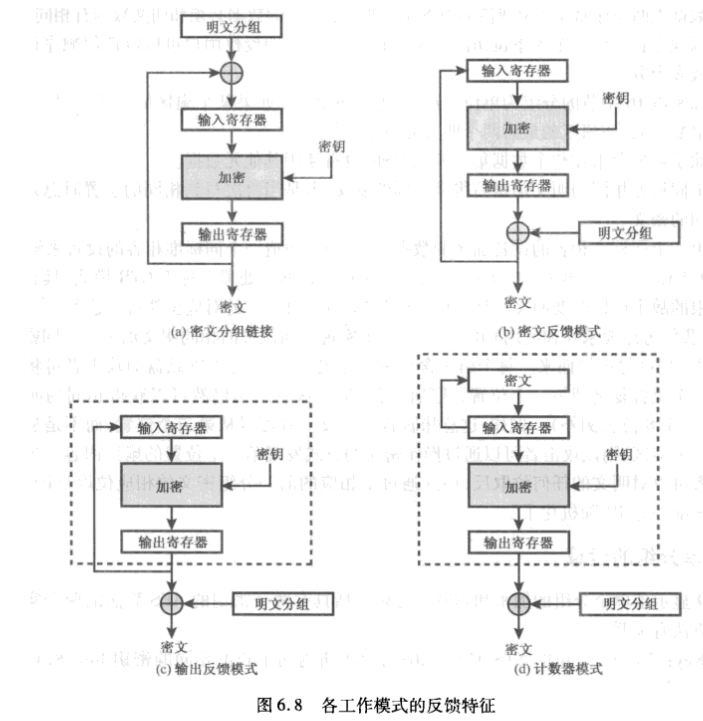

1. 简介
    1. ECB
        电码本。使用同样的密钥分别对明文分组单独加密。输入b位明文分组与b位密钥，输出b位密文。最后的分组不是完整分组时，填充至b位。 适用于数据较少的情况。如果有几个相同的明文组，那么密文中也会有几个相同的密文组。
    2. CBC
        密文分组链接。加密算法的输入是上一个密文组和当前明文组的异或。最后的分组不是完整分组时，填充至b位。解密时，每个密文分组分别解密，再与上一块密文异或，就可以恢复出明文。 第一块明文可以与一个初始向量IV异或后再加密，解密时将第一块密文解密的结果与初始向量异或从而恢复出第一块明文。 初始向量必须为收发双方共享，但第三方不能预测；对于任意给定明文，在IV产生前，不能预测和本明文关联的IV。为了最大程度的安全，IV不能不经授权而修改。对IV先用ECB加密再发送可以实现这一要求。 攻击者可以欺骗接收者，让他使用不同的IV，这样它就能将第一个分组的某些位取反。还有其他攻击IV的方法。 只要IV是不可预测的，具体选择什么做IV就不重要。 SP800-38A推荐两种方法： 
        1. 使用加密函数加密一个时变值， 使用和明文加密相同的密钥。 这个时变值的重复概率应该可忽略，可以是计数器/时间戳/消息数目之类的东西。
        2. 使用随机数发生器产生一个随机数分组。
         
        适合加密长于b位的消息。也可以用于认证。
    3. CFB
        密文反馈。一次处理s位，上一块密文作为加密算法的输入，产生的伪随机数输出与明文异或作为下一单元的密文。
         可以用于流密码的加密。 page145 经典流密码输入某个初始值和密钥，输出位流，这个位流再与明文位进行异或运算。而CFB模式中与明文异或的位流是与明文相关的，这与经典流密码的做法不同。
    4. OFB
        输出反馈。与CFB类似，加密算法的输入是上一次加密的输出，且使用整个分组 可以用于流密码的加密。 优点：传输过程中某位的错误不会影响其他位 缺点：抗消息流篡改攻击的能力不如CFB。 OFB中与明文异或的位流是密钥和初始值的函数，与明文独立，是经典流密码的结构。但是，OFB一次加密一个明文数分组，一般是64bit或128bit，而流密码一般一次加密一个字节。
    5. CTR
        计数器。每个明文分组与以一个经过加密的计数器异或。后续分组计数器递增。计数器与明文分组长度相同。 可以用于流密码的加密。 SP800-38A对计数器模式的唯一要求是加密不同明文组的计数器值必须是不同的。
        1. 经典做法是，计数器初始化位某个值，然后随着消息块的增加，计数器+1。模2^b。加密时，计数器加密后与明文分组异或得到密文分组，没有链接。 解密使用相同的计数器序列，用加密后的计数器与密文分组异或，恢复出明文。解密时需要知道计数器初始值。 如果最后的明文不足b位，不需填充。 初始计数器的值必须为时变值；使用相同密钥的所有消息必须用不同的初始计数器。这要求计数器处理消息后+1。
        2. 优点
            1. 硬件效率
                由于没有采用链接模式，吞吐量仅受可并行度的限制
            2. 软件效率
                也是由于可并行计算
            3. 预处理
                基本加密算法的执行不依靠明文或密文的输入，因此如果有充足的存储器可用并足够安全，可以预处理加密盒的输出，作为XOR函数的输入。 给出明文密文时，需要进行的计算仅仅是一系列XOR，可以极大地提高吞吐量
            4. 随机访问
                明文或密文的第i个分组能以一种随机访问的方式处理。
            5. 可证明安全性
            6. 简单性
                只要求实现加密算法，不要求实现解密算法
    6. 反馈特征
        1. 除了ECB， NIST批准的所有分组密码工作模式都含有反馈。
        2. 反馈模式图示
            
